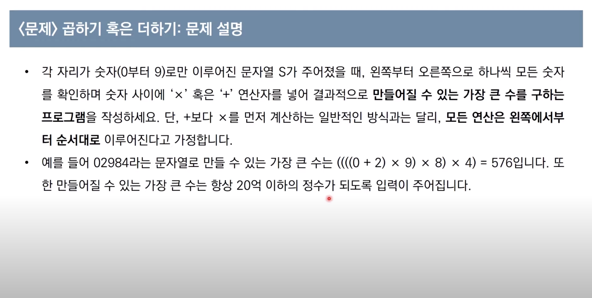
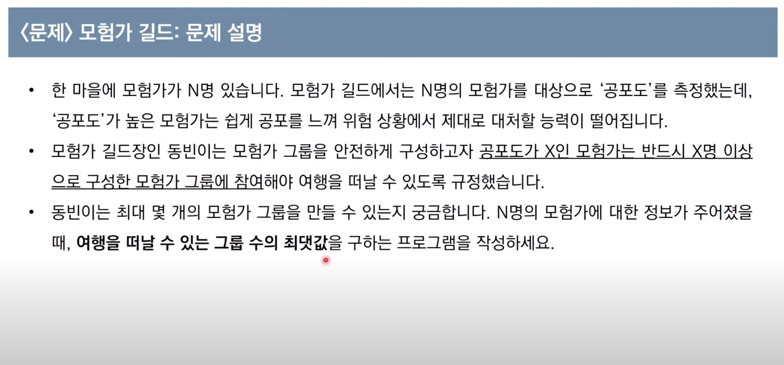
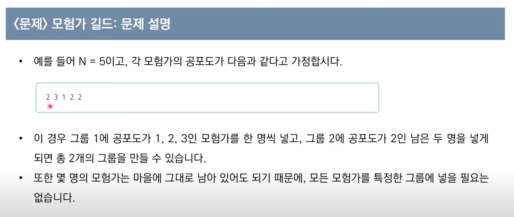
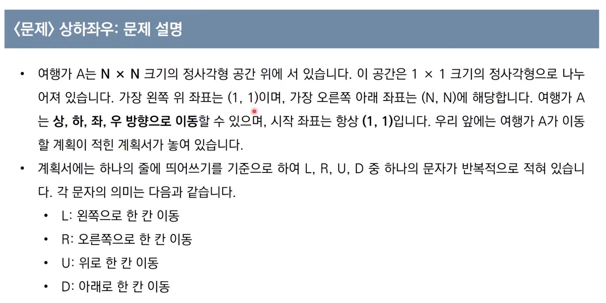

# 그리디 알고리즘

[강의 링크](https://www.youtube.com/watch?v=2zjoKjt97vQ&list=PLRx0vPvlEmdAghTr5mXQxGpHjWqSz0dgC&index=2&ab_channel=%EB%8F%99%EB%B9%88%EB%82%98)

- 그리디 알고리즘(탐욕법)은 현재 상황에서 지금 당장 좋은 것만 고르는 방법을 의미합니다. (숲이 아닌 나무를 보는 방법)
- 일반적인 그리디 알고리즘은 문제를 풀기 위한 최소한의 아이디어를 떠올릴 수 있는 능력을 요구합니다.
- 그리디 해법은 그 정당성 분석이 중요합니다.
    - __단순히 가장 좋아 보이는 것을 반복적으로 선택해도 최적의 해를 구할 수 있는지 검토가 필요 !__

## 예시 1 - 거스름 돈

500, 100, 50, 10 이 무수히 많고 1250원을 거슬러줘야할 때 -> 가능한 예시

- 위와 같은 경우엔 그리디로 문제를 풀 수 있는 정당성이 무엇일까?
    - `가지고 있는 동전 중에서 큰 단위가 항상 작은 단위의 배수이므로 작은 단위의 동전들을 종합해 다른 해가 나올 수 없기 때문`입니다.

만약에 800원을 거슬러 줘야하는 데 화폐단위가 500, 400, 100원이라면 어떻게 될까요?
    - 400원 2개를 거슬러줘야합니다 (500원을 먼저 거슬러 주면 안됨)

따라서, `정당성 검사가 가장 중요 !`

## 예시 2 - 곱하기 혹은 더하기



#### 문제 해결 아이디어

- 대부분의 경우 '+' 보다는 'x'가 값을 더 크게 만듭니다.
    - 5+6 = 11, 5*6 = 30
- 다만 두 수 중에서 하나라도 '0' 혹은 '1'이라면 더하기가 더 효율적

## 예시 3 - 모험가 길드




#### 문제 해결 아이디어

- 오름차순으로 정렬한 뒤, `현재 그룹에 포함된 모험가 수`가 `현재 확인하고 있는 공포도 수`보다 크거나 같다면 이를 그룹으로 설정

- 이러한 방법은 공포도가 오름차순으로 정렬되어 있다는 점에서, 항상 최소한의 모험가 수만 포함하여 그룹을 결성하게 됩니다.

# 구현

- 흔히 알고리즘 대회에서 구현 문제란?
    - 풀이를 떠올리는 것은 쉽지만, 소스코드로 옮기기 어려운 문제

- 구현 유형의 예시
    - 알고리즘은 간단한데 코드가 길어짐
    - 실수 연산 다루는 문제
    - 문자열을 특정한 기준에 따라서 끊어 처리해야하는 경우
    - 적절한 라이브러리를 찾아서 사용해야 하는 문제

## 예시 1 - 상하좌우




#### 문제 해결 아이디어

- 요구 사항대로 충실히 구현하면 되는 문제

```python
  
# N 입력받기
n = int(input())
x, y = 1, 1
plans = input().split()

# L, R, U, D에 따른 이동 방향
dx = [0, 0, -1, 1]
dy = [-1, 1, 0, 0]
move_types = ['L', 'R', 'U', 'D']

# 이동 계획을 하나씩 확인
for plan in plans:
    # 이동 후 좌표 구하기
    for i in range(len(move_types)):
        if plan == move_types[i]:
            nx = x + dx[i]
            ny = y + dy[i]
    # 공간을 벗어나는 경우 무시
    if nx < 1 or ny < 1 or nx > n or ny > n:
        continue
    # 이동 수행
    x, y = nx, ny

print(x, y)
```

## 예시 1 - 시각


#### 문제 해결 아이디어

- 이 문제는 가능한 모든 시각의 경우를 하나씩 모두 세서 풀 수 있는 문제
- 하루는 86,400초이므로 모든 경우는 86,400가지
    - 24 * 60 * 60
- 완전 탐색 문제

```python
# H를 입력받기
h = int(input())

count = 0
for i in range(h + 1):
    for j in range(60):
        for k in range(60):
            # 매 시각 안에 '3'이 포함되어 있다면 카운트 증가
            if '3' in str(i) + str(j) + str(k):
                count += 1

print(count)
```
