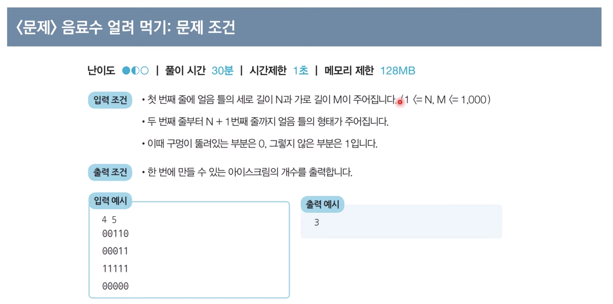
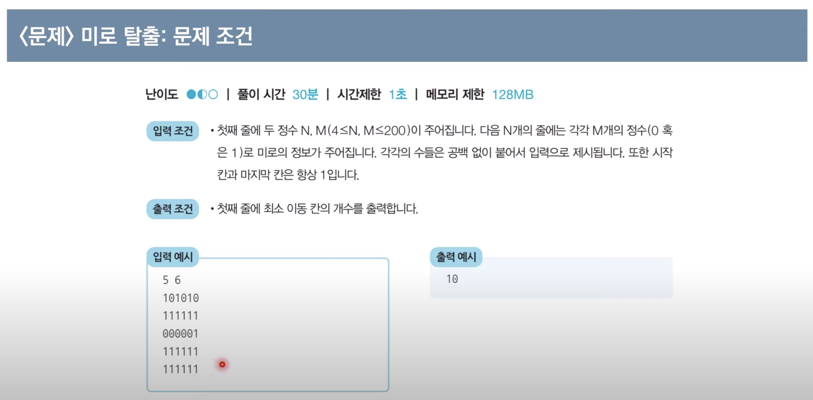

# DFS & BFS

## 스택과 큐

### Python - 스택
```python
stack = []

stack.append(5)
stack.pop()
```

### Java - 스택
```java
import java.util.*;

Stack<Integer> stack = new Stack<>();

stack.push(5);
stack.pop();
```

### Python - 큐
```python
from collections import deque

queue = deque()

queue.append(5)
queue.popleft()
```

### Java - 스택
```java
import java.util.*;

Queue<Integer> queue = new LinkedList<>();

queue.offer(5);
queue.offer(10);
queue.poll();

while(!queue.isEmpty()){
    System.out.println(queue.poll() + " ");
}
```

## 재귀 함수

- 자기 자신을 다시 호출하는 함수

### 재귀 함수 예시

#### 유클리드 호제법

두 자연수 A,B에 대하여 A를 B로 나눈 나머지를 R이라고 한다면, A,B의 최대공약수와 B와 R의 최대공약수는 같다 !

```python
def gcd(a, b):
    if a%b == 0:
        return b
    else:
        return (b, a%b)

print(gcd(192, 162)) # 6
```

- 재귀함수를 잘 활용하면 복잡한 알고리즘을 단순하게 해줌
    - 하지만, 다른 사람이 이해하기 어려운 형태의 코드가 됨
- 모든 재귀함수는 반복문으로 이용하여 동일한 기능 구현 가능
- 컴퓨터의 함수는 스택에 쌓이는 구조이기 때문에 스택을 구현할 때 재귀를 사용할 때도 있음

## DFS

- DFS는 깊이를 우선으로 탐색하는 알고리즘


### 예시 문제 - 음료수 얼려 먹기




#### 문제 해결 아이디어


1. 상하좌우를 확인한 후 0이면서 방문하지 않은 지점이 있다면 방문
2. 방문한 지점에서 1의 과정을 반복
3. 모든 노드에 대하여 1,2번을 반복하며, 방문하지 않은 지점의 수를 카운트합니다.

#### 풀이 코드 - Python

```python
# N, M을 공백을 기준으로 구분하여 입력 받기
n, m = map(int, input().split())

# 2차원 리스트의 맵 정보 입력 받기
graph = []
for i in range(n):
    graph.append(list(map(int, input())))

# DFS로 특정한 노드를 방문한 뒤에 연결된 모든 노드들도 방문
def dfs(x, y):
    # 주어진 범위를 벗어나는 경우에는 즉시 종료
    if x <= -1 or x >= n or y <= -1 or y >= m:
        return False
    # 현재 노드를 아직 방문하지 않았다면
    if graph[x][y] == 0:
        # 해당 노드 방문 처리
        graph[x][y] = 1
        # 상, 하, 좌, 우의 위치들도 모두 재귀적으로 호출
        dfs(x - 1, y)
        dfs(x, y - 1)
        dfs(x + 1, y)
        dfs(x, y + 1)
        return True
    return False

# 모든 노드(위치)에 대하여 음료수 채우기
result = 0
for i in range(n):
    for j in range(m):
        # 현재 위치에서 DFS 수행
        if dfs(i, j) == True:
            result += 1

print(result) # 정답 출력
```

#### 풀이 코드 - Java
```java
import java.util.*;

public class Main {

    public static int n, m;
    public static int[][] graph = new int[1000][1000];

    // DFS로 특정 노드를 방문하고 연결된 모든 노드들도 방문
    public static boolean dfs(int x, int y) {
        // 주어진 범위를 벗어나는 경우에는 즉시 종료
        if (x <= -1 || x >=n || y <= -1 || y >= m) {
            return false;
        }
        // 현재 노드를 아직 방문하지 않았다면
        if (graph[x][y] == 0) {
            // 해당 노드 방문 처리
            graph[x][y] = 1;
            // 상, 하, 좌, 우의 위치들도 모두 재귀적으로 호출
            dfs(x - 1, y);
            dfs(x, y - 1);
            dfs(x + 1, y);
            dfs(x, y + 1);
            return true;
        }
        return false;
    }

    public static void main(String[] args) {
        Scanner sc = new Scanner(System.in);

        // N, M을 공백을 기준으로 구분하여 입력 받기
        n = sc.nextInt();
        m = sc.nextInt();
        sc.nextLine(); // 버퍼 지우기

        // 2차원 리스트의 맵 정보 입력 받기
        for (int i = 0; i < n; i++) {
            String str = sc.nextLine();
            for (int j = 0; j < m; j++) {
                graph[i][j] = str.charAt(j) - '0';
            }
        }

        // 모든 노드(위치)에 대하여 음료수 채우기
        int result = 0;
        for (int i = 0; i < n; i++) {
            for (int j = 0; j < m; j++) {
                // 현재 위치에서 DFS 수행
                if (dfs(i, j)) {
                    result += 1;
                }
            }
        }
        System.out.println(result); // 정답 출력 
    }

}
```

### 예시 문제 2 - 미로 탈출

동빈이의 위치는 `(1,1)`, 미로의 출구는 `(N,M)`이고 한번에 한 칸씩 이동할 수 있습니다.
이때 괴물이 있는 부분은 0, 없는 부분은 1일 때, 탈출하기 위해 움직여야하는 칸의 최소 칸의 개수를 구하세요.



#### 문제 해결 아이디어


#### 문제 풀이 - Python
```python
from collections import deque

# N, M을 공백을 기준으로 구분하여 입력 받기
n, m = map(int, input().split())
# 2차원 리스트의 맵 정보 입력 받기
graph = []
for i in range(n):
    graph.append(list(map(int, input())))

# 이동할 네 가지 방향 정의 (상, 하, 좌, 우)
dx = [-1, 1, 0, 0]
dy = [0, 0, -1, 1]

# BFS 소스코드 구현
def bfs(x, y):
    # 큐(Queue) 구현을 위해 deque 라이브러리 사용
    queue = deque()
    queue.append((x, y))
    # 큐가 빌 때까지 반복하기
    while queue:
        x, y = queue.popleft()
        # 현재 위치에서 4가지 방향으로의 위치 확인
        for i in range(4):
            nx = x + dx[i]
            ny = y + dy[i]
            # 미로 찾기 공간을 벗어난 경우 무시
            if nx < 0 or nx >= n or ny < 0 or ny >= m:
                continue
            # 벽인 경우 무시
            if graph[nx][ny] == 0:
                continue
            # 해당 노드를 처음 방문하는 경우에만 최단 거리 기록
            if graph[nx][ny] == 1:
                graph[nx][ny] = graph[x][y] + 1
                queue.append((nx, ny))
    # 가장 오른쪽 아래까지의 최단 거리 반환
    return graph[n - 1][m - 1]

# BFS를 수행한 결과 출력
print(bfs(0, 0))
```