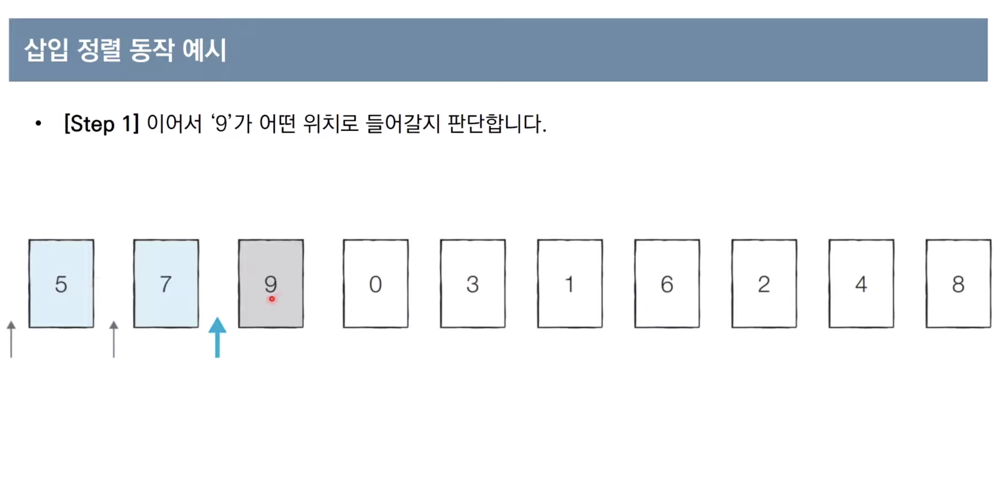

# 정렬 알고리즘

정렬이란?
- 데이터를 특정한 기준에 따라서 순서대로 나열하는 것

## 1. 선택 정렬 알고리즘

- 처리되지 않은 데이터 중에서 가장 작은 데이터를 `선택`해 맨 앞의 데이터와 바꾸는 것

#### 시간복잡도

- N번 만큼 가장 작은 수를 찾아서 맨 앞으로 보내야합니다.
- N + N-1 + N-2 + ... + 2 -> O(N*N)

## 2. 삽입 정렬 알고리즘

- 처리되지 않은 데이터를 골라 하나씩 `적절한 위치에 삽입`합니다.
- 선택 정렬보다 일반적으로 더 효율적으로 동작

#### 동작 예시




#### 구현 코드

```python
array = [7, 5, 9, 0, 3, 1, 6, 2, 4, 8]

for i in range(1, len(array)):
    for j in range(i, 0, -1): # 인덱스 i부터 1까지 1씩 감소하며 반복하는 문법
        if array[j] < array[j - 1]: # 한 칸씩 왼쪽으로 이동
            array[j], array[j - 1] = array[j - 1], array[j]
        else: # 자기보다 작은 데이터를 만나면 그 위치에서 멈춤
            break

print(array)
```

#### 시간복잡도

- 삽입 정렬의 시간 복잡도는 O(N*N)이며, 반복문이 2번 중첩됨
- 삽입 정렬은 현재 리스트의 데이터가 거의 정렬되어 있는 상태라면 매우 빠르게 동작
    - 최선의 경우 O(N)


## 3. 퀵 정렬 알고리즘

- 기준 데이터를 설정하고 그 기준보다 큰 데이터와 작은 데이터의 위치를 바꾸는 방법.
- 병합 정렬과 더불어 대부분의 프로그래밍 언어의 정렬 라이브러리의 근간이 되는 알고리즘입니다.
- 가장 기본적인 퀵 정렬은 첫번째 원소를 피봇으로 잡는다.
    - 평균 O(NlogN) 시간 복잡도를 가진다.
    - `이미 정렬된 배열`(최악의 겅우)에 `첫번째 원소를 피벗`으로 잡으면 O(N*N)이 걸릴 수 있다.


## 4. 계수 정렬 알고리즘

- 특정 조건이 부합할 때, 매우 빠르게 동작하는 정렬 알고리즘
    - 계수 정렬은 정수 형태로 표현할 수 있을 때 사용 가능합니다.
- 데이터의 개수가 N, 데이터(양수) 최대값이 K일 때, O(N+K)를 보장함 (시간+공간)
    - 데이터가 0과 999,999 단 2개일 경우 심각한 비효율성
- 최대값이 정해져있고 동일한 값을 가지는 데이터가 여러개 등장할 때 효과적으로 사용할 수 있다.
    - 성적의 경우 100점을 맞은 학생이 여러명일 수 있기 때문에 효과적