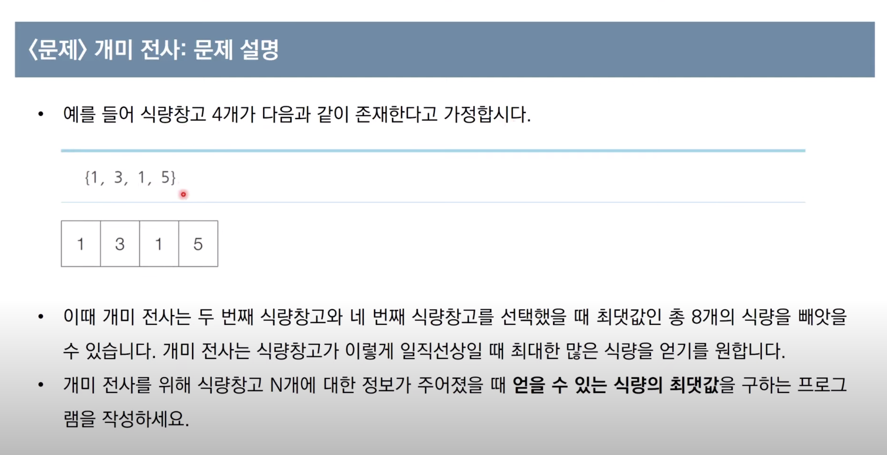
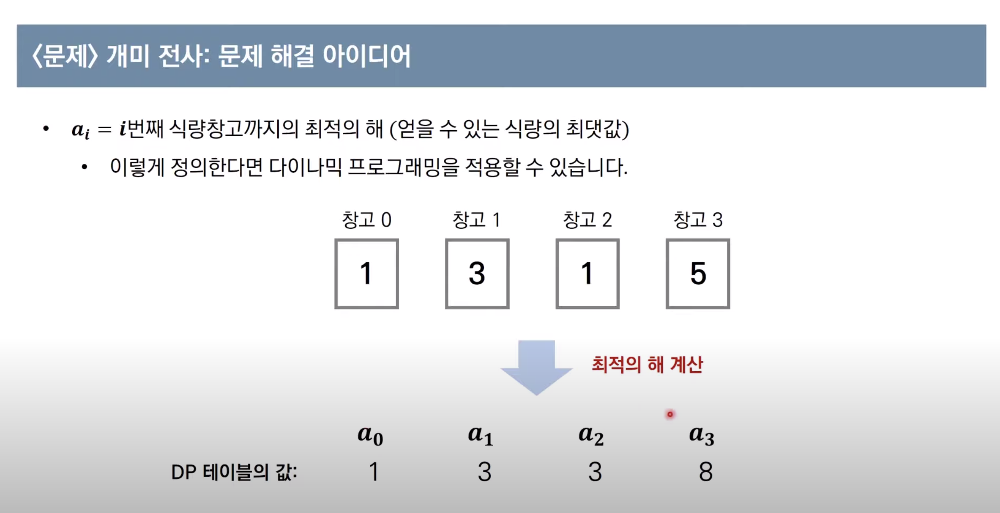
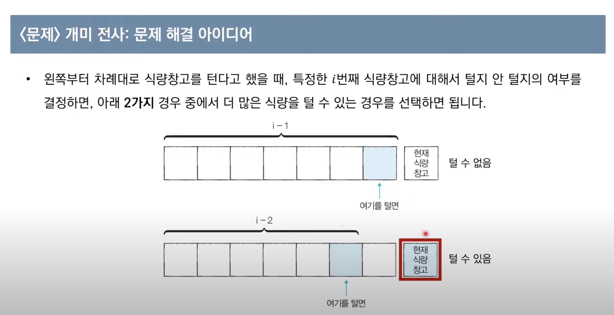
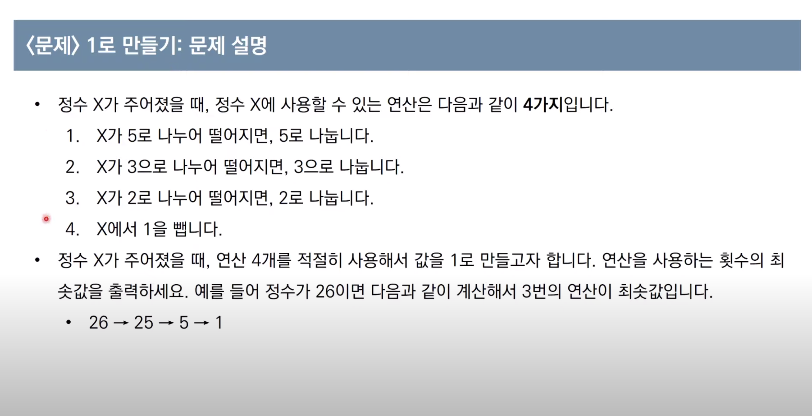

# 다이나믹 프로그래밍

- 메모리를 적절히 사용하여 수행 시간 효율성을 비약적으로 향상시키는 방법입니다.
- 이미 계산한 결과는 별도의 메모리 영역에 저장하여 다시 계산하지 않는 것
- DP 구현은 일반적으로 `탑-다운`, `바텀-업` 방식 2가지


## 다이나믹 프로그래밍의 효율적인 해법
1. 최적 부분 구조 : 큰 문제를 작은 문제로 나눌 수 있다.
2. 중복되는 부분 문제 :  동일한 작은 문제를 반복적으로 해결합니다.

- 피보나치 수열은 위의 사용 조건을 만족합니다.

#### 메모이제이션(Memoization)
- 메모이제이션은 다이나믹 프로그래밍을 구현하는 방법 중 하나입니다.
- 한 번 계산한 결과를 메모리 공간에 메모하는 기법입니다.
    - 같은 문제를 다시 호출하면 메모했던 결과를 그대로 가져옵니다.
    - 값을 기록해 놓는다는 점에서 `캐싱(Caching)`이라고도 합니다.
- 탑-다운(재귀 방식)
- 엄밀히 말하면, 다이나믹 프로그래밍에 국한된 개념은 아니다 !

## 탑-다운 방식
```python
# 한 번 계산된 결과를 메모이제이션(Memoization)하기 위한 리스트 초기화
d = [0] * 100

# 피보나치 함수(Fibonacci Function)를 재귀함수로 구현 (탑다운 다이나믹 프로그래밍)
def fibo(x):
    # 종료 조건(1 혹은 2일 때 1을 반환)
    if x == 1 or x == 2:
        return 1
    # 이미 계산한 적 있는 문제라면 그대로 반환
    if d[x] != 0:
        return d[x]
    # 아직 계산하지 않은 문제라면 점화식에 따라서 피보나치 결과 반환
    d[x] = fibo(x - 1) + fibo(x - 2)
    return d[x]

print(fibo(99))
```

## 바텀-업 방식
```python

# 앞서 계산된 결과를 저장하기 위한 DP 테이블 초기화
d = [0] * 100

# 첫 번째 피보나치 수와 두 번째 피보나치 수는 1
d[1] = 1
d[2] = 1
n = 99

# 피보나치 함수(Fibonacci Function) 반복문으로 구현(보텀업 다이나믹 프로그래밍)
for i in range(3, n + 1):
    d[i] = d[i - 1] + d[i - 2]

print(d[n])
```

## 다이나믹 프로그래밍 VS 분할 정복
- 다이나믹 프로그래밍과 분할 정복 모두 `최적 부분 구조`를 가질 때 사용합니다.
    - 큰 문제를 작은 문제로 나눌 수 있고, 작은 문제의 답을 모아서 큰 문제를 해결할 수 있는 상황

- 두가지의 차이점은 `부분 문제의 중복`입니다.
    - 다이나믹 프로그래밍에서는 각 부분 문제들이 서로 영향을 미치며 중복된다.
    - 분할 정복 문제에서는 동일한 부분 문제가 반복적으로 계산되지 않는다.

## 문제 예시 - 1



#### 접근 방법




#### 정답 : Python
```python
# 정수 N을 입력 받기
n = int(input())
# 모든 식량 정보 입력 받기
array = list(map(int, input().split()))

# 앞서 계산된 결과를 저장하기 위한 DP 테이블 초기화
d = [0] * 100

# 다이나믹 프로그래밍(Dynamic Programming) 진행 (보텀업)
d[0] = array[0]
d[1] = max(array[0], array[1]) 
for i in range(2, n):
    d[i] = max(d[i - 1], d[i - 2] + array[i])

# 계산된 결과 출력
print(d[n - 1])
```

#### 정답 : Java
```java
import java.util.*;

public class Main {

    // 앞서 계산된 결과를 저장하기 위한 DP 테이블 초기화 
    public static int[] d = new int[100];

    public static void main(String[] args) {
        Scanner sc = new Scanner(System.in);

        // 정수 N을 입력받기
        int n = sc.nextInt();

        // 모든 식량 정보 입력받기
        int[] arr = new int[n];
        for (int i = 0; i < n; i++) {
            arr[i] = sc.nextInt();
        }
        
        // 다이나믹 프로그래밍(Dynamic Programming) 진행(보텀업)
        d[0] = arr[0];
        d[1] = Math.max(arr[0], arr[1]);
        for (int i = 2; i < n; i++) {
            d[i] = Math.max(d[i - 1], d[i - 2] + arr[i]);
        }

        // 계산된 결과 출력
        System.out.println(d[n - 1]);
    }
}
```


## 문제 예시 - 2



#### 풀이 방법 - Python
```python
# 정수 X를 입력 받기
x = int(input())

# 앞서 계산된 결과를 저장하기 위한 DP 테이블 초기화
d = [0] * 1000001

# 다이나믹 프로그래밍(Dynamic Programming) 진행(보텀업)
for i in range(2, x + 1):
    # 현재의 수에서 1을 빼는 경우
    d[i] = d[i - 1] + 1
    # 현재의 수가 2로 나누어 떨어지는 경우
    if i % 2 == 0:
        d[i] = min(d[i], d[i // 2] + 1)
    # 현재의 수가 3으로 나누어 떨어지는 경우
    if i % 3 == 0:
        d[i] = min(d[i], d[i // 3] + 1)
    # 현재의 수가 5로 나누어 떨어지는 경우
    if i % 5 == 0:
        d[i] = min(d[i], d[i // 5] + 1)

print(d[x])

```